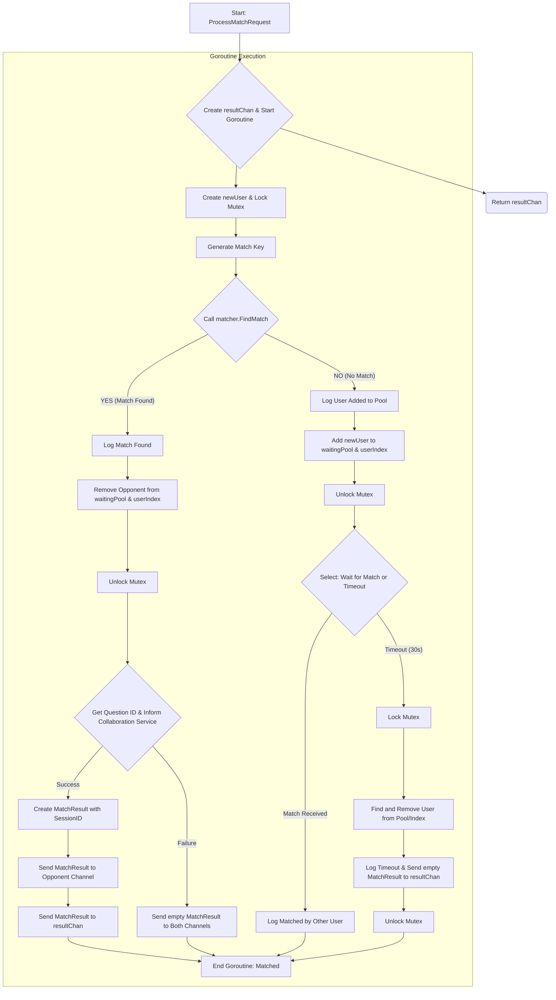

# AI Usage Log (Key Exchanges)

> [!Note]
>
> Many of my prompts are in Chinese. Here I translated them into English. I usually ask AI to get straight to the point, so the summary is essentially the code or the result itself.

AI Tools: Gemini 2.5 Pro (Web App & Using its API in Roo Code Plugin as a sidebar copilot.)

## `utils.go`

Me: Please add some concise and clear English comments to this function of mine, no more than five sentences.

AI: (Generated comments)

*Accepted after reading.*

## `mocks.go`

Me: Next, I plan to write some mock external services to test my service availability. Please generate placeholder functions according to my idea:

- Placeholder question: Directly return the concatenated key points plus a numeric suffix.
- Placeholder collaboration: Just print a log.

AI: (Generated codes)

*Modified, done test by actually run it.*

## `matchers.go`

Me: I need to complete a function to find the first common language. But I'm not very familiar with this type of operation in Golang yet. Please help me complete it based on my structure.

```pseudocode
FUNCTION findFirstCommonLang(list1, list2):
  Set = new empty Set

  FOR EACH language IN list1:
    ADD language TO Set

  FOR EACH language IN list2:
    IF language IS IN Set:
      RETURN language, TRUE
  RETURN empty string, FALSE
```

AI: (Generated code)

---

Me: I hope you can explain this point to me in detail.

AI: (Explained the iteration methods of Map in Golang, the usage of range, and its underlying structure, among other things.)

*Learned.*

## `handlers.go`

Me: Next are the functions of handlers. I've completed the structural design and most of the code. Please help me add the logic for `resultChan`.

AI: (Generated code.)

*Accepted after reading relevent parts in A tour to GO.*

---

Me: Please help me polish our message.

AI: (Generated polished strings.)

*Accepted.*

## `service.go`

Me: Please follow the cancellation method I provided to help me complete my `informCollaborationService`. Just use a similar approach as `getQuestionFromService`.

Me: Now I need to complete the final function. Please connect all the functions I've already written according to the architecture I designed.



Me: Please convert the waitingPool to a pointer slice and encode the URL as I said to fix the problems.

Me: Our code is a bit messy right now, please refactor it into a clearer and more readable version without changing any existing functionality.

*Additionally, the AI reminded me that I should add a defer for the mutex, and I took this advice. and it advised me to add a more precise log in `CancelMatchRequest`.*

```go
log.Error().Str("userId", userID).Msg("CRITICAL: User was in userIndex but not in waitingPool. State was inconsistent.")
```

